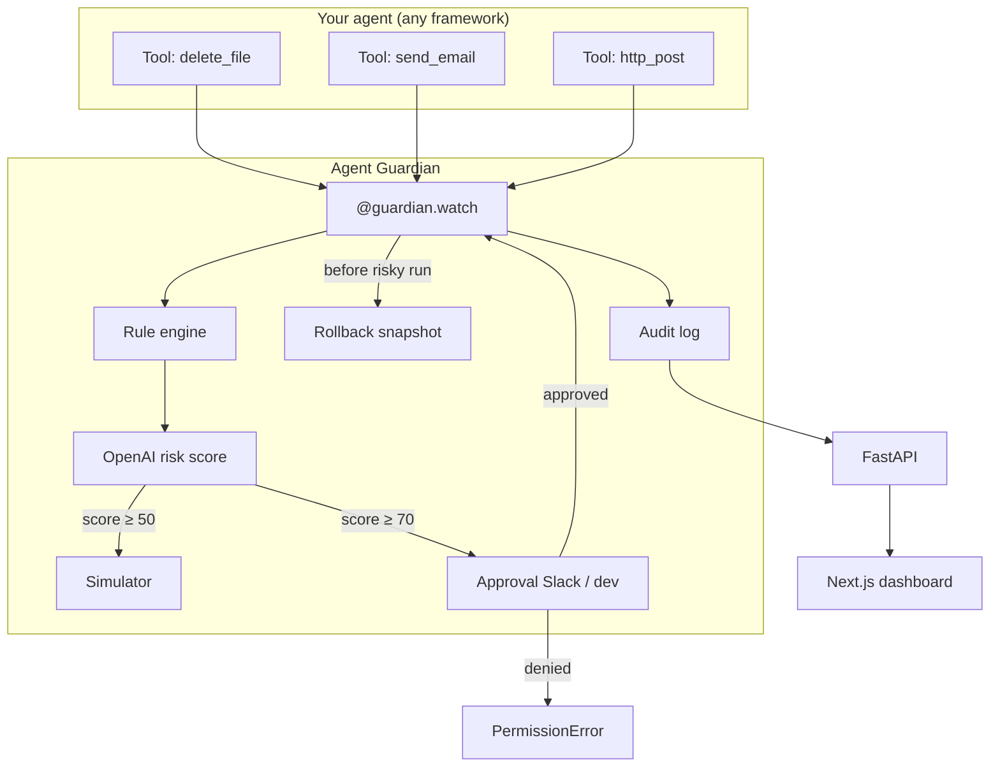

# Agent Guardian

**Real-time safety middleware for autonomous AI agents.**

I built Agent Guardian to solve a problem I kept running into: AI agents can call tools (delete files, send emails, hit APIs) with no guardrails. One bad step and the damage is done. This project adds a single decorator that intercepts every tool call, scores the risk, simulates dangerous actions, asks for human approval when needed, and supports rollback.

[](https://www.python.org/)
[](https://fastapi.tiangolo.com/)
[](LICENSE)

---

## What it does

| Step | Description |
|------|-------------|
| **Intercept** | `@guardian.watch` wraps any async Python function (your agent's tools) |
| **Detect** | Rule engine (<1 ms) + OpenAI `gpt-4o-mini` structured risk score (0–100) |
| **Simulate** | Medium/high-risk actions get a sandbox report + `gpt-4o` outcome judgment |
| **Approve** | High-risk actions pause for Slack Approve/Deny (or dev console) |
| **Rollback** | File snapshots before risky runs; restore from API or dashboard |

You **do not need a separate agent framework** to try it. Any function can be a "tool." LangChain, AutoGen, and CrewAI work by wrapping the same functions.

---

## Quick start

### 1. Clone and install

```bash
git clone https://github.com/<your-username>/agent-guardian.git
cd agent-guardian
python -m venv .venv

# Windows
.venv\Scripts\activate

# macOS / Linux
source .venv/bin/activate

pip install -e ".[dev]"
cp .env.example .env
```

### 2. Configure (optional for local demos)

Edit `.env`:

```env
OPENAI_API_KEY=sk-your-key-here   # optional: offline mode works without it
GUARDIAN_DEV_MODE=true
GUARDIAN_AUTO_APPROVE=false       # safe default: deny risky actions in dev
```

### 3. Run without any agent framework

```bash
python examples/quickstart_no_agent.py
```

You should see: a safe action runs, `rm -rf` is **blocked**, and a risky email is **denied** (unless you set `GUARDIAN_AUTO_APPROVE=true`).

### 4. Wrap your own tools

```python
import asyncio
from agent_guardian import watch

@watch
async def send_payment(amount: float, to_account: str) -> dict:
    # your real logic here
    return {"status": "sent", "amount": amount}

async def main():
    try:
        await send_payment(5000.0, "EXT-999")
    except PermissionError as e:
        print("Guardian stopped it:", e)

asyncio.run(main())
```

---

## Run the API and dashboard

**Terminal 1 — API**

```bash
python -m uvicorn agent_guardian.api.main:app --reload --port 8000
```

Open [http://127.0.0.1:8000/docs](http://127.0.0.1:8000/docs) for interactive API docs.

**Terminal 2 — Dashboard**

```bash
cd dashboard
npm install
set NEXT_PUBLIC_API_URL=http://127.0.0.1:8000   # Windows CMD
# export NEXT_PUBLIC_API_URL=http://127.0.0.1:8000   # macOS/Linux
npm run dev
```

Open [http://localhost:3000](http://localhost:3000) for the live action feed and risk overview.

**Docker (API + Redis)**

```bash
docker-compose up --build
```

---

## How OpenAI is used

| Task | Model |
|------|--------|
| Risk scoring (JSON: score, category, explanation) | `gpt-4o-mini` |
| Simulation outcome judgment | `gpt-4o` |

If `OPENAI_API_KEY` is missing, the **rule engine** and **offline heuristics** still block obvious attacks (`rm -rf`, `curl | bash`, etc.).

---

## Project structure

```
agent-guardian/
├── src/agent_guardian/
│   ├── core/           # interceptor, risk scorer, simulator, approver, rollback
│   └── api/            # FastAPI routes
├── dashboard/          # Next.js monitoring UI
├── examples/           # Runnable demos
├── tests/              # pytest suite
├── docker/             # Dockerfile + sandbox image
├── pyproject.toml
└── Makefile
```

---

## API reference

| Method | Path | Description |
|--------|------|-------------|
| `GET` | `/health` | Service health |
| `GET` | `/actions` | Audit log (recent actions) |
| `POST` | `/actions/score` | Score an action string |
| `GET` | `/actions/stats` | Aggregated risk stats |
| `POST` | `/approvals/approve` | Approve by `action_id` |
| `POST` | `/approvals/deny` | Deny by `action_id` |
| `POST` | `/rollback/{action_id}` | Rollback using stored snapshot |

---

## Environment variables

| Variable | Required | Default | Description |
|----------|----------|---------|-------------|
| `OPENAI_API_KEY` | For LLM scoring | — | OpenAI API key |
| `SLACK_BOT_TOKEN` | For Slack approvals | — | Slack bot token |
| `SLACK_CHANNEL_ID` | For Slack approvals | — | Channel ID |
| `REDIS_URL` | No | `redis://localhost:6379` | Snapshot / approval store |
| `GUARDIAN_DEV_MODE` | No | `true` | Console fallback when Slack is off |
| `GUARDIAN_AUTO_APPROVE` | No | `false` | Auto-approve in dev (use only for demos) |
| `ALLOW_CRITICAL` | No | `false` | Allow actions scored ≥95 |
| `SIMULATION_ENABLED` | No | `true` | Run simulation pipeline |

---

## Architecture



---

## Testing

```bash
pytest tests/ -q
# or
make test
```

Full local check:

```powershell
powershell -ExecutionPolicy Bypass -File scripts/verify.ps1
```

---

## Integrating with LangChain (optional)

Wrap each tool function once:

```python
from agent_guardian import watch

@watch
async def search_database(query: str) -> str:
    ...
```

The agent loop stays the same; Guardian runs on every tool invocation.

---

## Removing `.cursorrules` (optional)

This repo does **not** include a `.cursorrules` file. If you still have one from an older clone or fork, remove it:

**Delete the file**

```bash
# macOS / Linux
rm .cursorrules

# Windows (PowerShell)
Remove-Item .cursorrules
```

**Remove from Git history on GitHub**

```bash
git rm .cursorrules
git commit -m "chore: remove .cursorrules"
git push origin main
```

Then pull on any other machine:

```bash
git pull origin main
```

---

## License

MIT — see [LICENSE](LICENSE).
